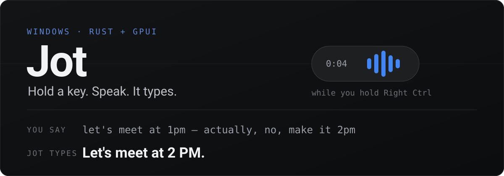
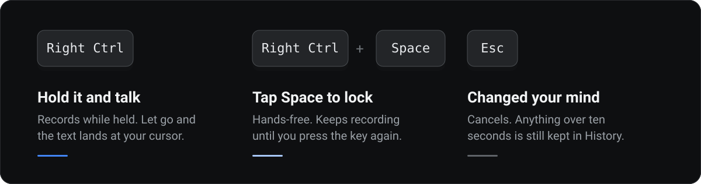
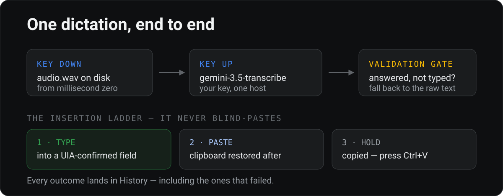
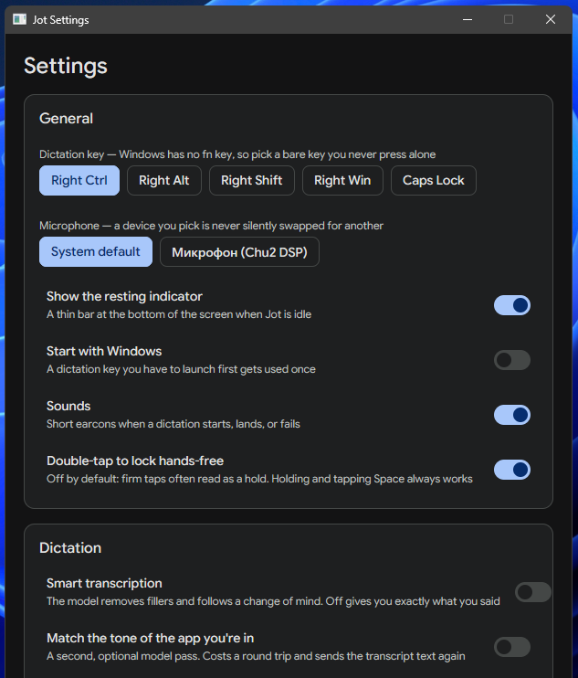

<p align="center">
  
</p>

<p align="center">
  <a href="https://github.com/ubranch/jot-gemini-transcribe-Windows/releases/latest"></a>
  <a href="https://github.com/ubranch/jot-gemini-transcribe-Windows/releases"></a>
  
  
  
</p>

<p align="center">
  <a href="https://github.com/ubranch/jot-gemini-transcribe-Windows/releases/latest">
    
  </a>
</p>

<p align="center">
  <sub>
    Portable · no installer · 10&nbsp;MB ·
    <a href="https://github.com/ubranch/jot-gemini-transcribe-Windows/releases/latest">all downloads</a> ·
    <a href="#build-it-yourself">or build from source</a>
  </sub>
</p>

<p align="center">
  <a href="#get-it-running"><b>Get it running</b></a> ·
  <a href="#the-three-gestures">Gestures</a> ·
  <a href="#why-it-is-different">Why it is different</a> ·
  <a href="#one-dictation-end-to-end">How it works</a> ·
  <a href="#settings">Settings</a> ·
  <a href="#build-it-yourself">Build</a>
</p>

Hold the dictation key, say the thing, let go. A moment later your words are in the app you were
already using — punctuated, filler words removed, cleaned up. No window to switch to, no transcript
to copy, no account to make.

## Get it running

1. **Download and unzip.** Grab [the latest release](https://github.com/ubranch/jot-gemini-transcribe-Windows/releases/latest)
   and run `jot.exe` from the folder. SmartScreen warns because the binary is unsigned — choose
   **More info → Run anyway**. Nothing is installed; deleting the folder uninstalls it.
2. **Paste a [Gemini API key](https://aistudio.google.com/apikey).** It goes into Windows Credential
   Manager, never into a settings file.
3. **Hold `Right Ctrl` and talk** — anywhere you can type. Windows asks for microphone permission the
   first time.

That is the whole setup, and it takes about two minutes. Prefer to compile it yourself? See
[Build it yourself](#build-it-yourself).

You pay Google for what you dictate at [Gemini API pricing](https://ai.google.dev/pricing); a free
tier exists and a typical dictation is a few seconds of audio. Jot itself is free and has no account.

## The three gestures

<p align="center">
  
</p>

Windows has no `fn` key — it is handled in keyboard firmware and never reaches a low-level hook — so
the default is **Right Ctrl**. Right Alt, Right Shift, Right Win and Caps Lock are also available.
Caps Lock and Right Win are swallowed while bound, so neither toggles shift-lock nor opens the Start
menu mid-dictation.

## Why it is different

- **It follows a change of mind.** Say *"let's meet at 1pm — actually, no, make it 2pm"* and you get
  **"Let's meet at 2 PM."** That is the whole pitch, and setup makes you do it once so you believe it.
- **It never loses your words.** Audio hits the disk from the first millisecond and the WAV header is
  rewritten every second, so a crash, a `taskkill` or a flat battery costs you nothing. Offline,
  dictations queue and land when you reconnect. Release the key mid-word and it keeps listening until
  you actually stop.
- **It is private by architecture.** Your voice goes from your PC straight to the Gemini API with
  *your* key. No middleman server, no account, no analytics, no keystroke logging. Nothing else
  leaves the machine unattended: the only other host Jot ever contacts is `github.com`, and only at
  the moment you open About to ask whether there is a newer version.
- **Your jargon, spelled right.** Names and product terms go in the Dictionary and ride along with
  the audio, so the model hears "Kubernetes" instead of guessing "cooper netties" — corrected at the
  source, not patched afterwards.

## One dictation, end to end

<p align="center">
  
</p>

The gate exists because a cleanup model sometimes *answers* your dictation instead of transcribing
it. When that happens Jot inserts the raw transcript rather than the model's opinion.

## Settings

<p align="center">
  
</p>

Pick the key, pick the microphone — a device you choose is never silently swapped for another — and
decide whether Jot starts with Windows. Recordings are kept for 7 days by default, or never, or
forever; transcripts stay until you delete them.

<details>
<summary><b>Ported, not translated</b> — the seven places Windows forced a different answer</summary>

<br>

| macOS | Windows | Why |
| --- | --- | --- |
| `fn` key | Right Ctrl | `fn` never reaches a Windows keyboard hook. |
| Hover-to-dictate dot, in-pill Stop | Informational pill; stop from the key or the tray | The pill is click-through and never activates. The alternative eats clicks across the bottom of every screen, or steals focus from the app the text is about to land in. |
| Liquid Glass pill | Solid elevated surface | Mica is an app-window material; it would tint the whole transparent rect. Nothing here pretends to be glass. |
| Accessibility API insertion | Typing into a UIA-confirmed control | Windows has no non-destructive insert-at-selection call — `SetValue` replaces a control's entire contents. |
| CAF + FLAC upload | WAV upload | One fewer encode on the latency path. |
| Keychain | Credential Manager | Same role, same guarantee. |
| Secure Input | UIA `IsPassword` + the secure desktop | Same rule: never record over, never paste into, a password field. |

</details>

<details>
<summary><b>What it cannot do yet</b> — stated rather than hidden</summary>

<br>

- The text fields support IME composition, so Chinese, Japanese, Korean and Vietnamese input compose
  and commit correctly, and they undo, redo and take a caret from a click — but they are not a full
  editor. No word-wise motion, no double-click to select a word, and the IME candidate window sits
  against the field rather than the caret.
- Clipboard text, HTML, RTF, file drops and images all survive a paste. GDI metafiles and palettes do
  not; they are handle-backed and cannot be copied byte-for-byte.
- There is no self-updater. About checks GitHub for a newer release when you open it and offers the
  download page; unzipping over the old folder is still your job.

</details>

<details>
<summary><b>Inside the code</b> — what lives where</summary>

<br>

```text
crates/jot-core/    the engine, headless and testable
  hotkey.rs           the low-level-hook key set and the pure hold/lock/cancel grammar
  audio.rs            crash-safe WASAPI capture, device changes, resampling
  gemini.rs           the API client: auth, deadlines, status mapping
  transcription.rs    the pipeline, retries, the vocabulary fail-open
  validation.rs       the "never insert garbage" gate
  insertion.rs        the type → paste → clipboard ladder
  history.rs          the SQLite index and retention
  recovery.rs         the offline queue and launch-time crash recovery
  coordinator.rs      the brain
  win32.rs            foreground app, focus kind, clipboard, synthetic input
crates/jot/         the GPUI app
  pill.rs             the HUD and its waveform
  text_field.rs       the single-line field, including IME composition
  window_shell.rs     overlay flags, DPI-correct placement, Windows 11 chrome
  autostart.rs        the per-user Run key
```

`jot-core` has no UI dependency, which is why the paths that can lose your words — the state machine,
the hotkey grammar, silence classification, the retry queue, crash recovery — are all exercised
without launching the app.

</details>

## Build it yourself

Requires Windows 10 or 11 and the toolchain pinned in `rust-toolchain.toml`.

```powershell
git clone https://github.com/ubranch/jot-gemini-transcribe-Windows
cd jot-gemini-transcribe-Windows
cargo run -p jot            # run it straight from source

cargo test                  # 204 tests, headless
cargo clippy --all-targets  # clean
./scripts/package.ps1       # release build, staged folder and zip
```

`package.ps1` runs the format, lint and test gates before it builds, and warns loudly when it
produces an unsigned binary — pass `-CertificateThumbprint` to sign. Jot is portable: no installer,
data in `%LOCALAPPDATA%\Jot`, and it adds itself to startup only when you turn that on.

Logging is lifecycle only — transcript text never appears in it — and rolls daily into
`%LOCALAPPDATA%\Jot\logs`:

```powershell
$env:JOT_LOG = "jot=debug,jot_core=debug"; cargo run -p jot
```

## License

Apache 2.0 — see [LICENSE](LICENSE). A Windows port of
[Jot](https://github.com/google-gemini/jot-gemini-transcribe-macOS) by Ammaar Reshi, rewritten in
Rust on [GPUI](https://www.gpui.rs). Not an officially supported Google product. Bundled fonts
(Google Sans Flex, Google Sans Code) are SIL OFL 1.1 and the earcons are original works under the
same Apache 2.0 licence — details in [THIRD_PARTY_NOTICES.md](THIRD_PARTY_NOTICES.md).
